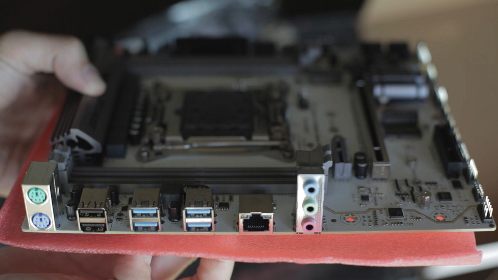
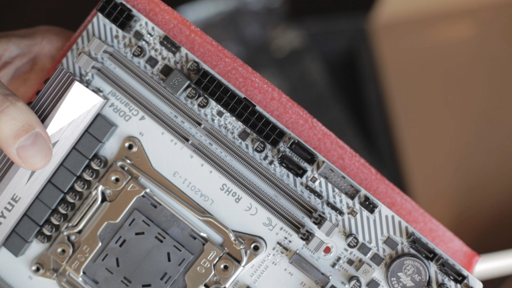
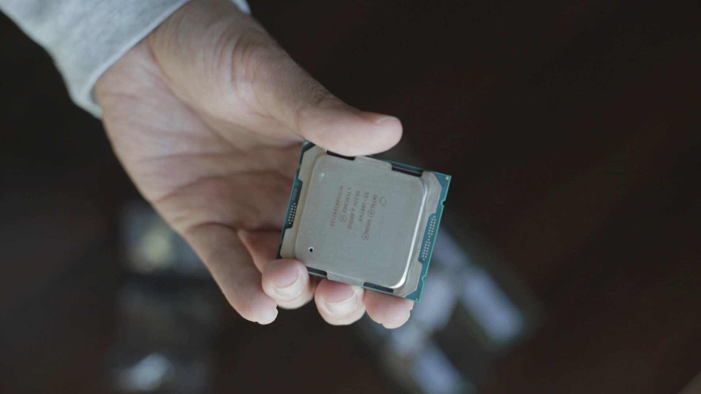
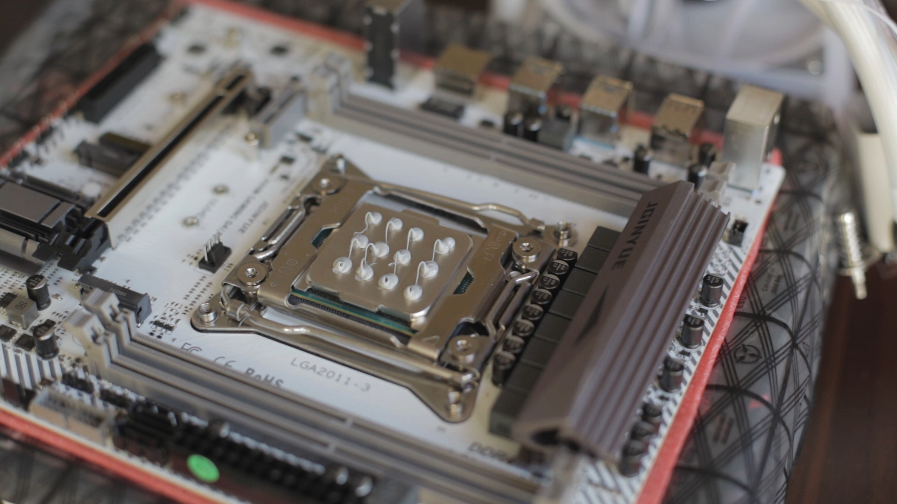
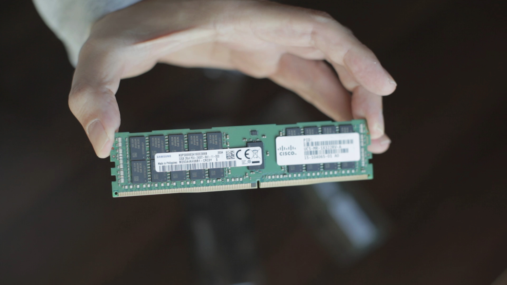
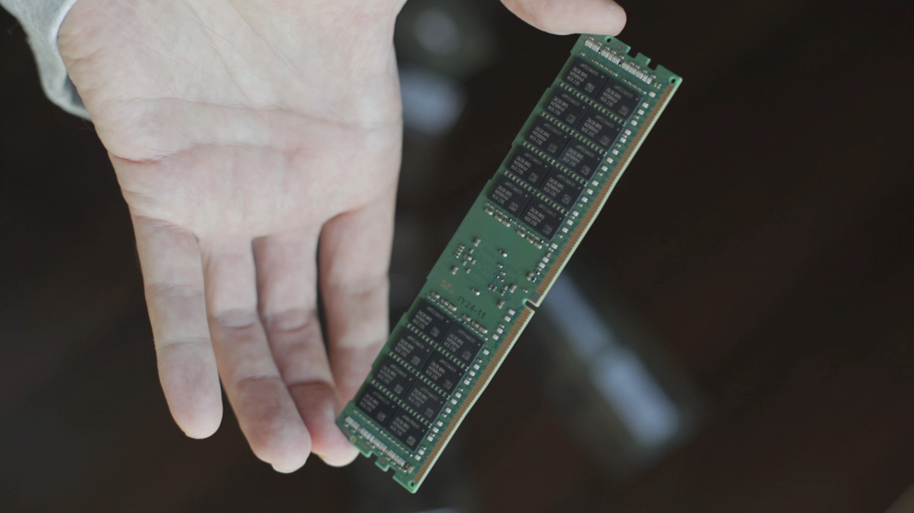
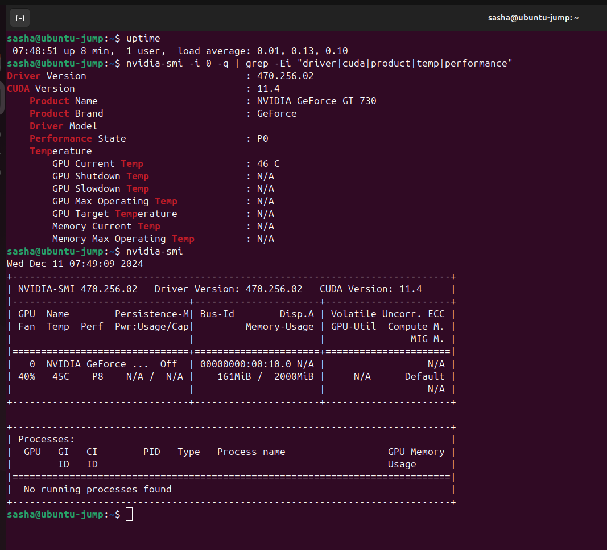
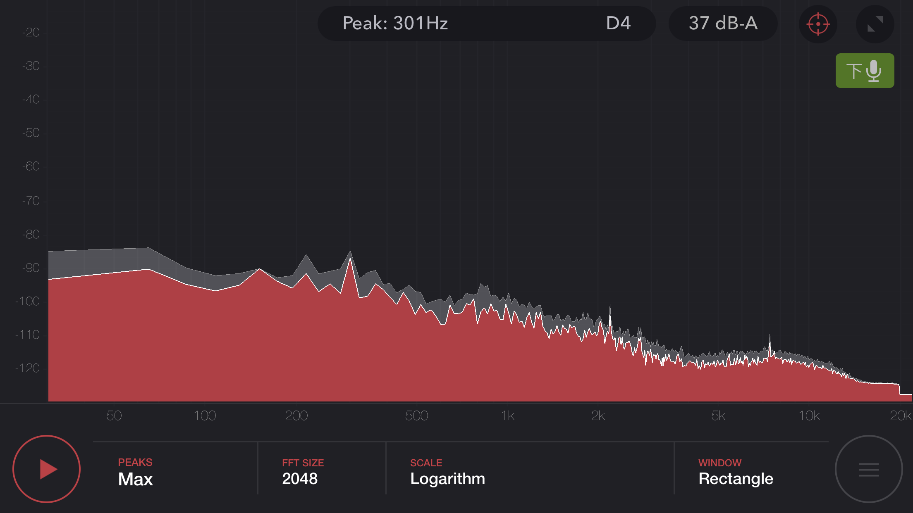

# Minimalistic GPU homelab server for AI/ML (2025 update)

These are my notes and not a refined guide. They are the build process walkthrough and also minimal instructions for the process that I usually follow to get a server up and running, and must be adjusted according to the actual needs.

## end result

- mATX-sized server with 24GB VRAM running GPU-accelerated LXC containers, ready to deploy docker stacks

## use cases

- running homelab VMs
- running inference on models that require 24GB of VRAM
  - hosting ollama with open webui
- running training/inference code that requires CUDA v.11-12, needs Pascal architecture GPU
- rendering videos on CPU and GPU
- data engineering tasks
- staging environment for Docker containers with GPU-accelerated apps
- code compilation

## my video about the build

[](https://www.youtube.com/watch?v=dfDnEBk9l6s "Building minimalistic homelab GPU server for Proxmox and Docker - 2024-12-7")

## to do

- [ ] mitigate https://cve.mitre.org/cgi-bin/cvename.cgi?name=CVE-2018-3646
- [ ] ARGB daemon (https://github.com/CalcProgrammer1/OpenRGB)
- [x] wifi client

## hardware

- **NVIDIA TESLA P40**, PCIe 3.0 x16, TDP 250 W - 1649 元 **used**
  - pros:
    - suppored by the latest driver (version 570 at the moment) and the latest CUDA 12
    - 24GB VRAM
  - cons:
    - no Tensor Cores (slower FP16 performance in comparison to Volta and newer architectures)
    - no video outputs
    - needs custom cooling solution
- 2x PCIe 8pin to 1x **EPS 8pin adapter** 18AWG - was included with the GPU
  - might be an overkill as I could just use the spare 8pin CPU power cable from the PSU, but better make use of the two PCIe power cables
- custom made **长城战龙 240mm ARGB**-based waterblock solution for GPU - 459 元
  - it's basically a CPU waterblock with a custom plate for the GPU core plus a set custom cut thermal pads.
- thermal compound **Thermalright TF7**, 12.8 W/m-k, 2g tube, two tubes - 20 元
- **鱼巢 S9** mATX case 21L, support for a 240mm waterblock (GPU) plus a 120mm waterblock (CPU) - 134 元
- **鑫谷 GM650W** PSU, 650W 80plus(gold label rating) - 352 元
- **精粤 X99M GAMING D4 ARGB** motherboard, X99 chipset, DDR4, LGA2011-3, one PCIe 3.0 x16, NVMe - 286 元
  - CPU: 40 PCIe gen3 lanes, Chipset: 8 PCIe gen2 lanes
- **冰曼 KS120 white ARGB** 120mm CPU waterblock - 116 元
- **Intel Xeon E5-2697v4** CPU, 18 cores 36 threads, 2.3GHz base, 3.6GHz turbo, 145W TDP - 215 元 **used**
- **Samsung 32GB DDR4 2400T ECC REG dual rank x4** memory, two modules - 344 元 **used**
- **NVMe SSD 500GB** gen4 x4, left from laptop storage upgrade
- ~~**wifi dongle** Realtek rtl8812bu wifi5 usb3, bought before~~
- Dell **NVIDIA GT730 GPU**, PCIe gen2 x1 - 133 元 **used**
  - latest supported driver version is 470
- Intel AX200 **NGFF wifi card** - 66 元
- **冰曼 GK120 white ARGB** 120mm fan, mistakenly bought the version without the lights on the blades, should've went with NK120 - 16 元

Total cost: 3800 元

## software

This hardware can run any commonly used x86 operating system, baremetal or virtualized. I chose to go with my usual stack:

- **Proxmox VE** `8.3.3`, kernel `6.8.12-8-pve` (2025-01-24T12:32Z)
- **NVIDIA driver** `570.86.15`
- **NVIDIA container toolkit** `1.17.4-1` - must upgrade to `1.17.8` or later to mitigate CVE-2025-23266 and CVE-2025-23267
- OpenWRT, VM
  - WiFi client
- OPNsense, VM
  - sensei/suricata IPS
  - NAT, firewall, OpenVPN
- Debian 12, LXC for websites
  - [my webserver docker stack](https://github.com/placebeyondtheclouds/gpu-webserver-docker-stack):
    - ollama
    - open-webui
- Debian 12, LXC for training
  - conda, jupyter lab
- Debian 12, LXC for home network tools
  - [my homelab services docker stack](https://github.com/placebeyondtheclouds/my-homelab-services-docker-stack):
    - Homepage
    - hashcat
    - jellyfin
    - Juice server (GPU-over-IP)
    - IT tools

> [!WARNING]
> work in progress

## principles

- only selected websites are exposed to the internet through the reverse proxy plus waf plus cloudflare public dns with basic protections
- all other services are accessed through VPN/LAN
- the GPU resource is shared between the LXCs
- services are deployed with docker

## hardware setup pictures

|  |  |  |
| :------------------------------------: | :------------------------------------: | :------------------------------------: |

|  |  |  |
| :------------------------------------: | :------------------------------------: | :------------------------------------: |

|  |  |  |
| :------------------------------------: | :-----------------------------------------: | :-----------------------------------------: |

|  |  |  |
| :------------------------------------------: | :------------------------------------------: | :------------------------------------------: |

|  |  |  |
| :------------------------------------------: | :------------------------------------------: | :------------------------------------------: |

|  |  |  |
| :------------------------------------------: | :------------------------------------------: | :------------------------------------------: |

|  |  |  |
| :------------------------------------------: | :------------------------------------------: | :------------------------------------------: |

|  |  |  |
| :------------------------------------------: | :------------------------------------------: | :------------------------------------------: |

|  |  |  |
| :------------------------------------------: | :------------------------------------------: | :------------------------------------------: |

|  |  |  |
| :------------------------------------------: | :------------------------------------------: | :------------------------------------------: |

|  |  |  |
| :------------------------------------------: | :------------------------------------------: | :------------------------------------------: |

|  |  |  |
| :------------------------------------------: | :------------------------------------------: | :------------------------------------------: |

|  |  |  |
| :------------------------------------------: | :------------------------------------------: | :------------------------------------------: |

|  |  |  |
| :------------------------------------------: | :------------------------------------------: | :------------------------------------------: |

|  |  |  |
| :------------------------------------------: | :------------------------------------------: | :------------------------------------------: |

|  |  |  |
| :------------------------------------------: | :------------------------------------------: | :------------------------------------------: |

|  |  |  |
| :------------------------------------------: | :------------------------------------------: | :------------------------------------------: |

|  |  |  |
| :------------------------------------------: | :------------------------------------------: | :------------------------------------------: |

|  |  |  |
| :------------------------------------------: | :------------------------------------------: | :------------------------------------------: |

|  |  |  |
| :------------------------------------------: | :------------------------------------------: | :------------------------------------------: |

## hardware setup process

- assemble minimal setup with CPU, RAM, the small GPU, PSU, motherboard and get it to POST

- there are no rules for populating memory banks, the motherboard has 1 slot per channel (Xeon E5 has 4 memory channels)

- boot Ubuntu Live cd and check if the P40 is recognized

- check BIOS version, reflash from the official website just in case

- remove the P40 and install the waterblock on it

- CPU waterblock fan connected to the CFAN1 PWM fan header (FAN1 in BIOS), GPU waterblock fan connected to the SFAN1 PWM header (FAN2 in BIOS)

- set up BIOS
  - advanced -> smart fan function -> set both PWM1 to 100
  - PCI subsystem settings ->
    - Enable above 4G decoding (otherwise will be faced with `Insufficient PCI resources detected`)
    - Enable Re-Size BAR Support [explainer](https://www.reddit.com/r/pcmasterrace/comments/1b4sy75/comment/kt24k82/)
    - Enable SR-IOV Support
    - MMIOHBase set to 2T
  - CSM configuration -> UEFI only
  - intelRCSetup
    - advanced power management configuration ->
      - power technology -> energy efficient
      - config TDP -> disable
      - CPU - advanced pm tuning -> energy perf bias ->
        - energy performance tuning - enable
        - workload -> balanced
    - PCH configuration ->
      - PCH sSATA configuration -> sSATA controller -> disable
      - PCH SATA configuration -> SATA controller -> disable
      - PCH devices -> restore AC after power loss -> power on

- install the P40
- disconnect fan cable from the GT730, it's noisy and the GPU is not overheating without it at idle
  <br>

- _edit:_ I added one more 120MM fan to the front panel blowing alongside the GPUs, just to be on the safe side

## software setup process

### hypervisor

- boot Proxmox VE 8.3 live cd, hit `e` and add `nomodeset` to the kernel command line, `ctrl` + `x` to boot (because GT730 is too old for the drivers in proxmox). I used my [hardware CD-ROM emulator](https://github.com/placebeyondtheclouds/rpi-cdrom-emulator-build) to boot from the [ISO](https://enterprise.proxmox.com/iso/proxmox-ve_8.3-1.iso). complete the installation and boot into proxmox.

#### set up virtualization (IOMMU and VFIO), blacklist default drivers

- `nano /etc/default/grub` replace the value with:
  - ```
    GRUB_CMDLINE_LINUX_DEFAULT="intel_iommu=on iommu=pt nomodeset"

    ```

- ```bash
  tee /etc/modprobe.d/blacklist.conf <<-'EOF'
  blacklist nouveau
  blacklist snd_hda_intel
  EOF
  ```

This is for using NVIDIA driver for P40 on the host with LXCs. To change this config to use the P40 in a VM with PCIe passthrough, modules load order must be specified prioritizing vfio-pci like `softdep nvidia pre: vfio-pci`, and the ID of the P40 must be added like `options vfio-pci ids=10de:1b38` to `/etc/modprobe.d/vfio.conf` in order to isolate the GPU from the host. I'm _not_ going down this route with this build. The GT730 can be passed through to a VM without making any changes since none of the drivers for it are initialized.

- ```bash
  tee /etc/modules-load.d/modules.conf <<-'EOF'
  nvidia
  nvidia-modeset
  nvidia_uvm
  vfio
  vfio_iommu_type1
  vfio_pci
  EOF
  ```

- ```bash
  tee /etc/udev/rules.d/70-nvidia.rules <<-'EOF'
  KERNEL=="nvidia", RUN+="/bin/bash -c '/usr/bin/nvidia-smi -L && /bin/chmod 666 /dev/nvidia*'"
  KERNEL=="nvidia_modeset", RUN+="/bin/bash -c '/usr/bin/nvidia-modprobe -c0 -m && /bin/chmod 666 /dev/nvidia-modeset*'"
  KERNEL=="nvidia_uvm", RUN+="/bin/bash -c '/usr/bin/nvidia-modprobe -c0 -u && /bin/chmod 666 /dev/nvidia-uvm*'"
  EOF
  ```
- do `udevadm control --reload-rules && udevadm trigger` if not planning to reboot shortly

- `update-initramfs -u && update-grub && proxmox-boot-tool refresh && reboot`

- `dmesg | grep -e DMAR -e IOMMU`
  - should see `DMAR: Intel(R) Virtualization Technology for Directed I/O`

#### set up updates

for China:

```bash
tee /etc/apt/sources.list <<-'EOF'
#deb http://ftp.debian.org/debian bookworm main contrib
deb https://mirrors.tuna.tsinghua.edu.cn/debian/ bookworm main contrib

#deb http://ftp.debian.org/debian bookworm-updates main contrib
deb https://mirrors.tuna.tsinghua.edu.cn/debian/ bookworm-updates main contrib

# security updates
#deb http://security.debian.org bookworm-security main contrib
deb https://security.debian.org/debian-security bookworm-security main contrib

# deb http://download.proxmox.com/debian/pve bookworm pve-no-subscription
deb https://mirrors.tuna.tsinghua.edu.cn/proxmox/debian/pve bookworm pve-no-subscription
EOF
```

for the rest of the world:

```bash
tee /etc/apt/sources.list <<-'EOF'
deb http://ftp.debian.org/debian bookworm main contrib
deb http://ftp.debian.org/debian bookworm-updates main contrib

# Proxmox VE pve-no-subscription repository provided by proxmox.com,
# NOT recommended for production use
deb http://download.proxmox.com/debian/pve bookworm pve-no-subscription

# security updates
deb http://security.debian.org/debian-security bookworm-security main contrib
```

`rm /etc/apt/sources.list.d/pve-enterprise.list`

```bash
cat > /etc/apt/sources.list.d/ceph.list << EOF
deb http://download.proxmox.com/debian/ceph-reef bookworm no-subscription
EOF
```

`apt update && apt full-upgrade -y`

`sed -Ezi.bak "s/(Ext.Msg.show\(\{\s+title: gettext\('No valid sub)/void\(\{ \/\/\1/g" /usr/share/javascript/proxmox-widget-toolkit/proxmoxlib.js && systemctl restart pveproxy.service`

`apt install mc screen iputils-tracepath stress s-tui iptraf-ng unzip lshw lm-sensors freeipmi-tools htop btop -y`

`sensors-detect --auto`

`shutdown -r now`

#### pin the kernel version

if it's not pinned, NVIDIA driver kernel module would break after the kernel update.

```bash
uname -r
proxmox-boot-tool kernel list
proxmox-boot-tool kernel pin 6.8.12-8-pve  --next-boot
proxmox-boot-tool refresh
```

`reboot` and verify that the kernel is working. then pin the kernel version permanently:

```bash
uname -r
proxmox-boot-tool kernel pin 6.8.12-8-pve
proxmox-boot-tool refresh
```

#### tune power consumption

- `apt install powertop`

switch to powersave mode at startup:

```bash
tee -a /var/spool/cron/crontabs/root <<-'EOF'
@reboot /usr/sbin/powertop --auto-tune
@reboot /bin/echo powersave | /usr/bin/tee /sys/devices/system/cpu/cpu*/cpufreq/scaling_governor
EOF
```

after reboot check with:

- `grep . /sys/devices/system/cpu/cpu0/cpufreq/*`

#### test CPU stability

- `apt install stress s-tui`
- `watch -n1 "cat /proc/cpuinfo | grep MHz"`
- `stress --cpu 36 --timeout 120`

#### check the GPU

```bash
lspci | grep NVIDIA
lspci -n -vv -s 07:00 | grep -Ei "lnk|slot"
dmidecode -t slot | grep -Ei "id:|bus"
dmidecode --type 9 | grep "Designation: Slot4" -B3 -A10
```

the output of `lspci` should say `LnkSta: Speed 8GT/s, Width x16` under load and `LnkSta: Speed 2.5GT/s (downgraded), Width x16` when the driver is installed and no processes are using the GPU

#### install NVIDIA drivers for the P40

install the kernel headers first, then the drivers. the headers are needed to compile kernel modules of the nvidia drivers and other drivers that might be installed in the future. `pve-headers` is deprecated circa 2023.

```bash
apt install proxmox-headers-$(uname -r)
apt-mark hold proxmox-headers-$(uname -r)
```

do not, and I repeat **do not** install the drivers from the apt repository, unless you want to update the driver in all of the containers on the machine and also on the hypervisor _every time_ you need to add another LXC. the repository does not contain older versions of the driver, and the driver version must be the same across all the containers and the hypervisor. use the installer file instead:

```bash
apt install -y dkms wget
wget https://download.nvidia.com/XFree86/Linux-x86_64/575.57.08/NVIDIA-Linux-x86_64-575.57.08.run
chmod +x NVIDIA-Linux-x86_64-575.57.08.run
./NVIDIA-Linux-x86_64-575.57.08.run
```

uninstall (if needed) with:

```bash
/usr/bin/nvidia-uninstall
```

~~- driver installation method using the repository:~~

~~`nvidia-smi` binary has been moved to `nvidia-cuda-driver` package since version 565 (https://forums.developer.nvidia.com/t/nvidia-smi-missing-for-565-drivers-debian-12-packages/311702/5)~~

~~Must install the same driver version on the host and in the LXC. The headers must be installed before the driver. The container will use kernel modules loaded on the host, LXC needs to install the drivers only because it needs the libraries and other binaries.~~

```bash
#curl -fSsL https://developer.download.nvidia.com/compute/cuda/repos/debian12/x86_64/3bf863cc.pub | gpg --dearmor | tee /usr/share/keyrings/nvidia-drivers.gpg > /dev/null 2>&1
#apt update
#apt install dirmngr ca-certificates software-properties-common apt-transport-https dkms -y
#echo 'deb [signed-by=/usr/share/keyrings/nvidia-drivers.gpg] https://developer.download.nvidia.com/compute/cuda/repos/debian12/x86_64/ /' | tee /etc/apt/sources.list.d/nvidia-drivers.list
#apt update
#apt install cuda-drivers nvtop -y
#apt list --installed | grep nvidia
#reboot
```

- `lspci -nnk | grep -i nvidia`
  - should see `Kernel driver in use: nvidia`

#### (optional) overclock GPU core from 1303 to 1531 MHz at idle

- `nvidia-smi -i 0 -q | grep -Ei "driver|product|bus|link|max|current|performance"`
- `nvidia-smi -q -i 0 -d CLOCK`

gives me current core clock of 1303 MHz and max core clock of 1531 MHz, memory already at max 3615 MHz

set the core clock to the max, leave the memory clock as is:

```bash
nvidia-smi -q -i 0 -d SUPPORTED_CLOCKS
nvidia-smi -pm ENABLED -i 0
nvidia-smi -ac 3615,1531 -i 0
nvidia-smi -q -i 0 -d CLOCK
```

now shows 1531 MHz for the core clock. this is not persistent between reboots. reset to default with `nvidia-smi  -rac -i 0`

## LXCs

### common setup for all LXCs

- download Debian-12 template and create unprivileged LXC with Debian 12.
  - Options -> Features -> keyctl=1,nesting=1 (this is [required](https://pve.proxmox.com/wiki/Linux_Container) for running docker in LXC)

- add GPU to the config, run `ls -al /dev/nv* | grep -v nvme`. the output on my system is like this:

```
root@pve:~# ls -al /dev/nv* | grep -v nvme
crw-rw-rw- 1 root root 195,   0 Apr  5 09:40 /dev/nvidia0
crw-rw-rw- 1 root root 195, 255 Apr  5 09:40 /dev/nvidiactl
crw-rw-rw- 1 root root 195, 254 Apr  5 09:40 /dev/nvidia-modeset
crw-rw-rw- 1 root root 235,   0 Apr  5 09:40 /dev/nvidia-uvm
crw-rw-rw- 1 root root 235,   1 Apr  5 09:40 /dev/nvidia-uvm-tools
crw------- 1 root root  10, 144 Apr  5 09:40 /dev/nvram

/dev/nvidia-caps:
total 0
drw-rw-rw-  2 root root     80 Apr  5 09:40 .
drwxr-xr-x 23 root root   4740 Apr  5 15:33 ..
cr--------  1 root root 238, 1 Apr  5 09:40 nvidia-cap1
cr--r--r--  1 root root 238, 2 Apr  5 09:40 nvidia-cap2
root@pve:~#
```

then edit `nano /etc/pve/lxc/100.conf` according to the output:

```
lxc.cgroup2.devices.allow: c 195:0 rw
lxc.cgroup2.devices.allow: c 195:255 rw
lxc.cgroup2.devices.allow: c 195:254 rw
lxc.cgroup2.devices.allow: c 235:0 rw
lxc.cgroup2.devices.allow: c 235:1 rw
lxc.cgroup2.devices.allow: c 10:144 rw
lxc.cgroup2.devices.allow: c 238:1 rw
lxc.cgroup2.devices.allow: c 238:2 rw
lxc.mount.entry: /dev/nvidia0 dev/nvidia0 none bind,optional,create=file
lxc.mount.entry: /dev/nvidiactl dev/nvidiactl none bind,optional,create=file
lxc.mount.entry: /dev/nvidia-modeset dev/nvidia-modeset none bind,optional,create=file
lxc.mount.entry: /dev/nvidia-uvm dev/nvidia-uvm none bind,optional,create=file
lxc.mount.entry: /dev/nvidia-uvm-tools dev/nvidia-uvm-tools none bind,optional,create=file
lxc.mount.entry: /dev/nvram dev/nvram none bind,optional,create=file
lxc.mount.entry: /dev/nvidia-caps/nvidia-cap1 dev/nvidia-caps/nvidia-cap1 none bind,optional,create=file
lxc.mount.entry: /dev/nvidia-caps/nvidia-cap2 dev/nvidia-caps/nvidia-cap2 none bind,optional,create=file
```

The major and minor device numbers **might change after host system software or nvidia driver upgrade**, must edit the configs accordingly. `rw` is sufficient for GPU access.

start the LXC, the following commands are to be executed inside the LXC

- add local admin: `adduser admin && usermod -aG sudo admin`

- login as root, or do `sudo su` if logged in as a user

- `dpkg-reconfigure locales` and set en_US.UTF-8 as default

- `timedatectl set-timezone Asia/Shanghai`

- (optional) set up the updates (again, my closest mirrors in China)

```bash
tee /etc/apt/sources.list <<-'EOF'
# 默认注释了源码镜像以提高 apt update 速度，如有需要可自行取消注释
deb https://mirrors.tuna.tsinghua.edu.cn/debian/ bookworm main contrib non-free non-free-firmware
# deb-src https://mirrors.tuna.tsinghua.edu.cn/debian/ bookworm main contrib non-free non-free-firmware

deb https://mirrors.tuna.tsinghua.edu.cn/debian/ bookworm-updates main contrib non-free non-free-firmware
# deb-src https://mirrors.tuna.tsinghua.edu.cn/debian/ bookworm-updates main contrib non-free non-free-firmware

deb https://mirrors.tuna.tsinghua.edu.cn/debian/ bookworm-backports main contrib non-free non-free-firmware
# deb-src https://mirrors.tuna.tsinghua.edu.cn/debian/ bookworm-backports main contrib non-free non-free-firmware

# 以下安全更新软件源包含了官方源与镜像站配置，如有需要可自行修改注释切换
deb https://security.debian.org/debian-security bookworm-security main contrib non-free non-free-firmware
# deb-src https://security.debian.org/debian-security bookworm-security main contrib non-free non-free-firmware

EOF

apt update && apt upgrade -y
```

- `apt install ifupdown2 -y` fixes 5 minute hang after LXC start

- `apt install linux-headers-amd64 -y`

- ` apt-mark hold linux-headers-amd64`

- `apt install screen curl gpg rsync -y`

- install NVIDIA drivers, same commands as for the host minus the `proxmox-headers-$(uname -r)` package, and the driver installer file must be run like this:

```bash
./NVIDIA-Linux-x86_64-575.57.08.run --no-kernel-module
```

`Enter` through the prompts.

### continue setting up the Debian LXC with GPU-enabled docker

the following commands are to be executed inside the LXC.

- increase sshd rate limiting thresholds, otherwise [docker would fail to deploy stacks with large number of containers](https://forums.docker.com/t/docker-compose-through-ssh-failing-and-referring-to-docker-example-com/115165/18). Docker opens multiple ssh connections to remote server when used with DOCKER_HOST (or context), and it will hit the default rate limit of 10 connections when deploying a large docker-compose file.

```bash
sudo sed -i 's/#MaxStartups 10:30:100/MaxStartups 100:30:100/' /etc/ssh/sshd_config
sudo systemctl restart ssh sshd
```

- install docker engine. this is a basic setup and must be adjusted according to the actual needs:

```
# Add Docker's official GPG key:
sudo apt-get update
sudo apt-get install ca-certificates curl
sudo install -m 0755 -d /etc/apt/keyrings
sudo curl -fsSL https://download.docker.com/linux/debian/gpg -o /etc/apt/keyrings/docker.asc
sudo chmod a+r /etc/apt/keyrings/docker.asc

# Add the repository to Apt sources:
echo \
  "deb [arch=$(dpkg --print-architecture) signed-by=/etc/apt/keyrings/docker.asc] https://download.docker.com/linux/debian \
  $(. /etc/os-release && echo "$VERSION_CODENAME") stable" | \
  sudo tee /etc/apt/sources.list.d/docker.list > /dev/null
sudo apt-get update
sudo apt-get install docker-ce docker-ce-cli containerd.io docker-buildx-plugin docker-compose-plugin -y
sudo usermod -aG docker $USER && newgrp docker
```

- set network subnets for docker to use. the default /16 is too large, when it gets exhaused docker will start to allocate 192.168. pool which might conflict with home network. `nano /etc/docker/daemon.json` and insert the following before the last curly bracket:

```
,
  "default-address-pools": [
    {
      "base" : "172.16.0.0/12",
      "size" : 24
    }
  ]
```

- set up proxy settings for docker (if needed)

- add NVIDIA repository (to install the nvidia-container-toolkit)

```bash
curl -fSsL https://developer.download.nvidia.com/compute/cuda/repos/debian12/x86_64/3bf863cc.pub | gpg --dearmor | tee /usr/share/keyrings/nvidia-drivers.gpg > /dev/null 2>&1
apt update
apt install dirmngr ca-certificates software-properties-common apt-transport-https dkms -y
echo 'deb [signed-by=/usr/share/keyrings/nvidia-drivers.gpg] https://developer.download.nvidia.com/compute/cuda/repos/debian12/x86_64/ /' | tee /etc/apt/sources.list.d/nvidia-drivers.list
apt update
```

- install nvidia-container-toolkit

```bash
apt install nvidia-container-toolkit -y
sed -i 's/#no-cgroups = false/no-cgroups = true/' /etc/nvidia-container-runtime/config.toml
nvidia-ctk runtime configure --runtime=docker
systemctl restart docker
```

- check with `nvidia-container-cli -k -d /dev/tty info`

- test with `docker info | grep -i runtime` and `docker run --rm --runtime=nvidia --gpus all ubuntu nvidia-smi`

- benchmark the GPU with `docker run --rm -it --gpus=all nvcr.io/nvidia/k8s/cuda-sample:nbody nbody -gpu -benchmark`

- add ssh key and deploy my GPU webserver docker stack using DOCKER_HOST

> [!WARNING]
> work in progress

### check the GPU stability [under load](https://github.com/placebeyondtheclouds/my-homelab-services-docker-stack?tab=readme-ov-file#hashcat)

- `nvidia-smi -q -i 0 -d PERFORMANCE` must have event reasons `Not Active`

### Debian LXC for homelab network services

clone an LXC with docker (use unique MAC address and ID), down the existing stack, prune images

```bash
docker stop $(docker ps -a -q)
docker rm $(docker ps -a -q)
docker system prune -a
```

shutdown the LXC, in the hypervisor shell run: `pct fstrim 105 && fstrim -a -v`

[add ssh key and deploy homelab network services stack](https://github.com/placebeyondtheclouds/my-homelab-services-docker-stack)

> [!WARNING]
> work in progress

### Debian LXC for training

same as above, clone and wipe an LXC.

the usual setup with miniconda, jupyter lab, etc.

bind mount the data dir on the host:

```bash
pct set 105 -mp0 /mnt/training,mp=/mnt/training
```

### Debian LXC video rendering on CPU

- https://www.edoardomarascalchi.it/2024/01/how-to-render-a-kdenlive-project-on-a-different-computer/

> [!WARNING]
> work in progress

### (optional) ARGB

> [!WARNING]
> work in progress

## (optional) openwrt x86 VM

- `wget https://downloads.openwrt.org/releases/23.05.5/targets/x86/64/openwrt-23.05.5-x86-64-generic-ext4-combined.img.gz`
- `gunzip openwrt-*.img.gz`
- `qemu-img resize -f raw openwrt-*.img 8G` or any other size, 512MB should be enough
- create new VM (no drives, SeaBIOS)
- `qm importdisk 103 openwrt-23.05.5-x86-64-generic-ext4-combined.img local-lvm`
- set the disk to VirtIO block, discard=enabled, add
- change boot order
- add usb wifi dongle

start the vm. ssh into it, user `root`, password is blank.

add eth nic to connect to the internet temporarily, configure opkg feed links to the servers(mirror-03.infra.openwrt.org or downloads.openwrt.org or whatever that is working), install the packages for the wifi (`kmod-iwlwifi` and `iwlwifi-firmware-ax200` for AX200) and `wpa-supplicant-openssl` (for WPA3), reboot, connect to the wifi

continue expanding root filesystem

- `opkg update && opkg install lsblk fdisk losetup resize2fs`
- `lsblk -o PATH,SIZE,PARTUUID`
- `lsblk -o PATH,SIZE,PARTUUID > /root/lsblk_old.txt`
- `cat /boot/grub/grub.cfg`
- `fdisk /dev/sda` -> `p` -> `d` -> `2` -> `n` -> `p` -> `2` -> 33792 enter -> `enter` -> `n` -> `w`
- ```bash
  BOOT="$(sed -n -e "/\s\/boot\s.*$/{s///p;q}" /etc/mtab)"
  DISK="${BOOT%%[0-9]*}"
  PART="$((${BOOT##*[^0-9]}+1))"
  ROOT="${DISK}${PART}"
  LOOP="$(losetup -f)"
  losetup ${LOOP} ${ROOT}
  fsck.ext4 -y -f ${LOOP}
  resize2fs ${LOOP}
  reboot
  ```

## (optional) OPNsense VM

- https://opnsense.org/download/

user `installer`, password `opnsense`

> [!WARNING]
> work in progress

## making use of the GT730

it can be passed through to a VM with `x-vga=1` and connected with HDMI cable to a display or a TV to be used as a regular computer, "smart tv" etc. install 470 drivers for ubuntu and switch GDM to Xorg for video acceleration to work.

it can also be passed to a windows 11 vm, needs driver version 475.14.

Under the VM settings, go to Hardware -> Display Adapter = "none".

## Docker security

- https://github.com/wsargent/docker-cheat-sheet?tab=readme-ov-file#security

## Results

- noise around 38dB at 1 meter
  <br>
- idle at 64W, 120W with GPU VRAM loaded and idle, 250W with GPU under load
- usb dongles on `rtl8812bu` and `mt7921au` didn't work with OpenWRT, `mt7612u` was working but very unstable.
- must set up BIOS before installing the P40, because in some card-slot combinations with the P40 and the GT730 the system won't POST or will throw `Insufficient PCI resources detected` error
- looking back, I put way too much thermal compound on the CPU, a third of that amount would be enough. As for the GPU core, that was kinda intentional, to fill as much surface of the copper plate from both sides as possible.

## Conclusion

- should have chosen a less power hungry CPU (like E5-2650v4 or something that is still running the memory at 2400MT/s), there is no need in a CPU this powerful
- will have to use a NGFF wifi card with PCIe passthrough
- P40 is not very power efficient at idle when the VRAM is loaded
- the motherboard has PCIe gen3, so any newer GPU will work but data transfer speeds will be limited to gen3
- should've put less thermal paste on the CPU
- can't add a second GPU, the motherboard has only one PCIe x16 slot and the case is too small for a second waterblock to be put inside
- there are other motherboards, for instance, 云星 C612plus for 500 元, which has two PCIe x16 slots with two slot-spaces between them, which would allow to fit 2 GPUs in a slightly larger case, and it has the onboard video! But that would not be a minimalistic build anymore, since it would require a larger ATX case to fit the additional waterblock and the GPU.
- so a **better configuration** would be:
  - two Tesla V100 32GB
  - E-ATX C612 motherboard with two CPU sockets and two PCIe
  - two E5-2660v4
  - large tower case

## 感谢

感谢可可借给我一个很好用的键盘

## references

- https://arnon.dk/matching-sm-architectures-arch-and-gencode-for-various-nvidia-cards/
- https://www.playtool.com/pages/psuconnectors/connectors.html
- https://www.coolermaster.com/en-global/guide-and-resources/what-is-80-plus-efficiency/
- https://en.wikipedia.org/wiki/Intel_X99
- https://jginyue.com.cn/index/Article/show/cat_id/48/id/195
- https://ark.intel.com/content/www/us/en/ark/products/91755/intel-xeon-processor-e5-2697-v4-45m-cache-2-30-ghz.html
- https://memory.net/product/m393a4k40cb1-crc-samsung-1x-32gb-ddr4-2400-rdimm-pc4-19200t-r-dual-rank-x4-module/
- https://github.com/morrownr/USB-WiFi/blob/main/home/USB_WiFi_Adapters_that_are_supported_with_Linux_in-kernel_drivers.md#chipset---realtek-rtl8812bu---supported-in-kernel-since-linux-kernel-62-2023-but-kernel-612-2024-is-recommended-due-to-stability-and-performance-enhancements
- https://www.thermalright.com/product/tf7-2g/
- https://www.techpowerup.com/gpu-specs/geforce-gt-730.c2590
- https://www.techpowerup.com/gpu-specs/tesla-p40.c2878
- https://www.bilibili.com/video/BV1gz4y187VR/
- https://www.bilibili.com/video/BV1co4y1H7KJ
- https://itgpt.net/note-book/%E6%B4%8B%E5%9E%83%E5%9C%BE%E4%B8%BB%E6%9C%BA/CPU%E9%B8%A1%E8%A1%80BIOS
- https://www.servethehome.com/intel-xeon-e5-2600-v4-broadwell-ep-launched/intel-xeon-e5-2600-v4-family-comparison/
- https://www.reddit.com/r/homelab/comments/lli4mg/intel_e5_2600_v4_series_comparison/
- https://pmcvtm.com/adding-openrgb-to-proxmox
- https://gist.github.com/subrezon/b9aa2014343f934fbf69e579ecfc8da8
- https://digitalspaceport.com/proxmox-multi-gpu-passthru-for-lxc-and-docker-ai-homelab-server/
- https://forum.openwrt.org/t/howto-resizing-root-partition-on-x86/140631
- https://docs.nvidia.com/deploy/driver-persistence/index.html
- https://forum.proxmox.com/threads/pci-gpu-passthrough-on-proxmox-ve-8-installation-and-configuration.130218/
- https://pve.proxmox.com/wiki/Linux_Container
- https://en.wikipedia.org/wiki/Pascal_(microarchitecture)
- https://developer.nvidia.com/blog/increase-performance-gpu-boost-k80-autoboost/
- https://forum.level1techs.com/t/gaming-on-my-tesla-more-likely-than-you-think/171185
- https://www.youtube.com/watch?v=0ZDr5h52OOE
- https://unix.stackexchange.com/questions/189670/whats-the-difference-of-etc-modules-load-d-and-etc-modules
- https://www.youtube.com/watch?v=fgx3NMk6F54
- https://docs.nvidia.com/datacenter/cloud-native/container-toolkit/latest/install-guide.html
- https://docs.nvidia.com/datacenter/tesla/driver-installation-guide/#debian
- https://pve.proxmox.com/wiki/Package_Repositories#sysadmin_no_subscription_repo
- https://forums.docker.com/t/docker-compose-through-ssh-failing-and-referring-to-docker-example-com/115165/18
- https://github.com/JingShing/How-to-use-tesla-p40
- https://wolfadvancedtechnology.com/nvidia-gpu-architecture/
- https://www.digitalocean.com/community/tutorials/understanding-tensor-cores
- https://digitalspaceport.com/proxmox-lxc-gpu-passthru-setup-guide/
- https://blog.konpat.me/dev/2019/03/11/setting-up-lxc-for-intel-gpu-proxmox.html
